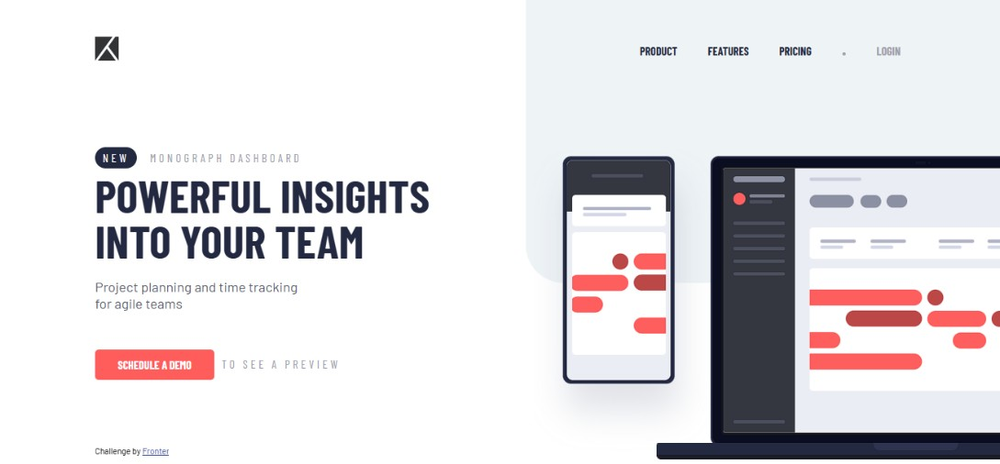

# Frontend Mentor - Project tracking intro component solution

This is a solution to the [Project tracking intro component challenge on Frontend Mentor](https://www.frontendmentor.io/challenges/project-tracking-intro-component-5d289097500fcb331a67d80e). Frontend Mentor challenges help you improve your coding skills by building realistic projects.

## Table of contents

- [Overview](#overview)
  - [The challenge](#the-challenge)
  - [Screenshot](#screenshot)
  - [Links](#links)
- [My process](#my-process)
  - [Built with](#built-with)
  - [What I learned](#what-i-learned)
- [Author](#author)

## Overview

### The challenge

Users should be able to:

- View the optimal layout for the site depending on their device's screen size
- See hover states for all interactive elements on the page
- Create the background shape using code

### Screenshot

### Links

- Solution URL: [Add solution URL here](https://www.frontendmentor.io/solutions/project-tracking-intro-component-master-solution-v1jqxRRRRm)
- Live Site URL: [Add live site URL here](https://pedrocrqs.github.io/project-tracking-intro-component-master/)

## My process

### Built with

- Semantic HTML5 markup
- CSS Position Property
- Flexbox
- CSS Grid
- Desktop-first workflow

### What I learned

I've learned some things while creating this project. One of these things is the importance of a mobile-first workflow (yes, I didn’t use it) to ensure clean code and proper design. Another key lesson is the correct use of position properties: if you overuse them, the mobile version may not display correctly on all devices. I spent several hours trying to unravel the correct way to use position and overflow properties, and in the end, I discovered that these properties need to be used carefully.

## Author

- Frontend Mentor - [@PedroCrqs](https://www.frontendmentor.io/profile/PedroCrqs)
